# 廖景輝 <span style="color:red">(1071082S)</span>

# Project 3 / Scene recognition with bag of words

## Overview
The project is related to 
* Two different classification techniques: tiny images and bags of SIFT features
* Two different image representations: nearest neighbor and linear SVM
  
## Procedure
In order to do scene recognition, we need to implement `Image representation`, and then we can use it to get features from training and testing data. We further implement `Classifier` to classify different scenes. Then we can recognize the category of images. 
### A. Image representations
We implement two different image representation methods. The first one is `tiny image`, and the other is a more powerful one - `bags of SIFT`.

#### tiny images
We know that input image is 16 * 16 numpy array and we need to reshape it to size 1 * 256 numpy array then normalize it. However, only resizing the image to smaller one as our features is a bad method. Because we don't extract its representative features well. Thus, we cannot get high prediction accuracy by this method.
```
def get_tiny_images(image_paths):

    resize_len = 16;
    for idx, img_path in enumerate(image_paths):
        img = Image.open(img_path);
        img_resize = img.resize((resize_len,resize_len),Image.BILINEAR);
        img_resize = np.array(img_resize);
        img_resize = np.reshape(img_resize,(1,resize_len*resize_len));
        img_avg = np.average(img_resize);
        img_var = np.var(img_resize);
        img_nor = (img_resize - img_avg) / math.sqrt(img_var);
        if idx == 0:
            tiny_images = img_nor;
        else:
            tiny_images = np.concatenate((tiny_images,img_nor));

    return tiny_images
```

#### bag of SIFTs
* vocabulary

    We build vocabulary first because we need to get bags of quantized SIFT features. Wes sample local features from training data and cluster them with k-means. Furthermore, we can change the `vocab_size` in "proj3.py" to change the total numbers of clusters and impact accuracy of building vocabulary. Then, we can save the vocabulary in `vocab.pkl`. 
    
    ```
    def build_vocabulary(image_paths, vocab_size):
        bag_of_features = []
        print("Extract SIFT features")
        for path in image_paths:
            img = np.asarray(Image.open(path),dtype='float32')
            frames, descriptors = dsift(img, step=[5,5], fast=True)
            bag_of_features.append(descriptors)
        bag_of_features = np.concatenate(bag_of_features, axis=0).astype('float32')
        print("Compute vocab")
        start_time = time()
        vocab = kmeans(bag_of_features, vocab_size, initialization="PLUSPLUS")        
        end_time = time()
        print("It takes ", (end_time - start_time), " to compute vocab.")

        return vocab
    ```
* bags of feature

    By loading `vocab.pkl`, we can get vocabulary information. We extract the features from input images and classify them into each cluster by calculate the difference between each input feature and cluster's feature. Simultaneously, we build a histogram indicating how many times each cluster was used and then normalized it. At this point, we can get the image_feats for one image. And after the loop operation, we can get the whole features of input image set.

    ```
    def get_bags_of_sifts(image_paths):
        # load vocab.pkl
        with open('vocab.pkl','rb') as f:
            vocab = pickle.load(f)
        centroid_num = vocab.shape[0];
        
        # initial output
        image_feats = np.zeros([len(image_paths),centroid_num])
        
        for idx,path in enumerate(image_paths):
            img = np.asarray(Image.open(path),dtype='float32');
            frames, descriptors = dsift(img, step=[5,5], fast=True);
            dist = distance.cdist(vocab, descriptors, 'euclidean');
            category_result = np.argmin(dist,axis=0);
            hist_value, bins = np.histogram(category_result,bins = range(centroid_num+1));    
            normalize = np.linalg.norm(hist_value,ord=1,axis=0);
            if normalize == 0:
                image_feats[idx,:] = hist_value;
            else:
                image_feats[idx,:] = hist_value / normalize;
                
        return image_feats
    ```

### B. Classifier
We implement classifier in order to use the train_image_feats, training label, and test_image_feats to classify test images into several categories. We implement two different methods, including nearest-neighbor and linear support_vector_machine.

* nearest neighbor

    The nearest neighbor classifier has many desirable features -- it requires no training, it can learn arbitrarily complex decision boundaries, and it trivially supports multiclass problems. The nearest_neighbor simply find the smallest distances between train_image_feats and test_image_feats for each feature. And when we find the smallest distance, we find its  correspondent training label. Thus, the recognized category of scene is based on this training label. 
    ```
    def nearest_neighbor_classify(train_image_feats, train_labels, test_image_feats):
        # initialization
        test_predicts = [0 for i in range(test_image_feats.shape[0])];
        
        # calculate the distance
        dist = distance.cdist(test_image_feats,train_image_feats,'euclidean');
        
        # find the nearest-neighbor
        dist_argmin = np.argmin(dist,axis=1);
        for test_num in range(test_image_feats.shape[0]):
            test_predicts[test_num] = train_labels[dist_argmin[test_num]];

        return test_predicts
    ```

* linear SVM

     Linear classifiers are one of the simplest possible learning models. The feature space is partitioned by a learned hyperplane and test cases are categorized based on which side of that hyperplane they fall on. Despite this model being far less expressive than the nearest neighbor classifier, it will often perform better.
We adopt the `LinearSVC` function and try to tune the cost term `"C"` to get the highest accuracy.
    ```
    def svm_classify(train_image_feats, train_labels, test_image_feats):
        classifier = LinearSVC(C= 200)
        classifier.fit(train_image_feats, train_labels)
        pred_label = classifier.predict(test_image_feats)
        
        return pred_label
    ```

### C. Experiment with different vocabulary sizes 
<table>
	<tr> 
		<td>vocab_size</td>
		<td> 200</td>
        <td> 400</td>
        <td> 800</td>
    </tr>
	<tr>
		<td> nearest neighbor </td>
		<td> 0.433</td>
		<td> 0.461</td>
        <td> 0.486</td>
	</tr>
	<tr>
		<td> SVM(C=200)</td>
		<td> 0.685</td>
        <td> 0.698</td>
        <td> 0.723</td>
	</tr>
</table>
We can observe that the accuracy grows with the vocab_size. Therefore, we adopt vocab_size = 800 as our model.

### D. Design decisions and evaluation of SVM with different "C"
<table>
	<tr> 
		<td></td>
		<td> accuracy</td>
    </tr>
	<tr>
		<td> C = 0.1</td>
		<td> 0.451</td>
	</tr>
    <tr>
		<td> C = 1</td>
		<td> 0.514</td>
	</tr>
    <tr>
		<td> C = 10</td>
		<td> 0.64</td>
	</tr>
    <tr>
		<td> C = 100</td>
		<td> 0.718</td>
	</tr>
    <tr>
		<td> C = 200</td>
		<td> 0.72</td>
	</tr>
    <tr>
		<td> C = 300</td>
		<td> 0.716</td>
	</tr>
    <tr>
		<td> C = 500</td>
		<td> 0.709</td>
	</tr>

</table>

We try to fine-tune the parameter "C" of the SVM. We finally choose C=200 because of its highest accuracy.

## Results
### Accuracy of different combinations
<table>
	<tr> 
		<td></td>
		<td> NN</td>
        <td> SVM(C=200)</td>
    </tr>
	<tr>
		<td> tiny image</td>
		<td> 0.227</td>
		<td> 0.132</td>
	</tr>
	<tr>
		<td> bag of SIFT(vocab=800)</td>
		<td> 0.486</td>
        <td> 0.723</td>
	</tr>
</table>

We can observe that the accuracy of bag-of-SIFT is better than tiny image. And the bag-of-SIFT with SVM is better than that with nearest neighbor.


### Confusion matrix (with vocab_size = 800, C = 200)
* tiny image / nearest neighbor (accuracy = 0.227)

    
* tiny image / SVM (accuracy = 0.132)

    
* bag of sift / nearest neighbor (accuracy = 0.486)

    
* bag of sift / SVM (accuracy = 0.723)

    


### Visualization
#### bags-of-SIFT (vocab_size=800) + linear SVM (C=200)
| Category name | Sample training images | Sample true positives | False positives with true label | False negatives with wrong predicted label |
| :-----------: | :--------------------: | :-------------------: | :-----------------------------: | :----------------------------------------: |
| Kitchen |  | 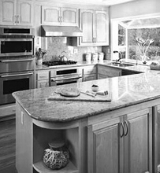 | 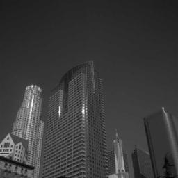 |  |
| Store |  |  | 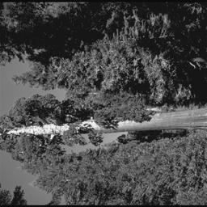 | 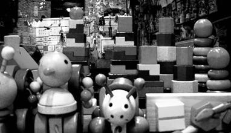 |
| Bedroom | 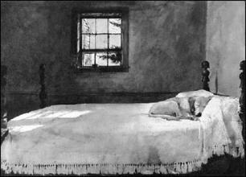 |  | 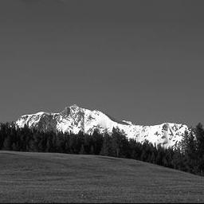 |  |
| LivingRoom |  |  |  |  |
| Office |  |  | 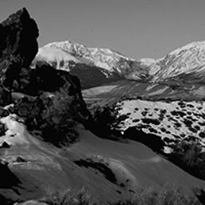 |  |
| Industrial | 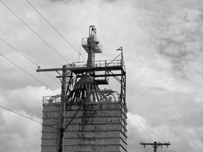 |  | 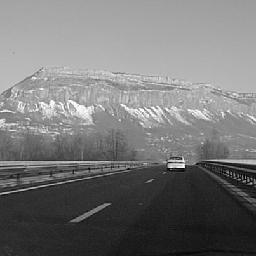 | 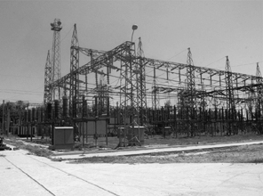 |
| Suburb |  | 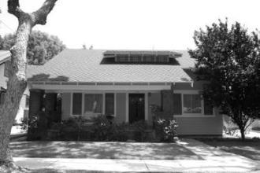 | 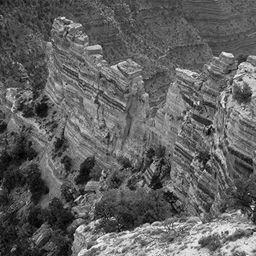 | 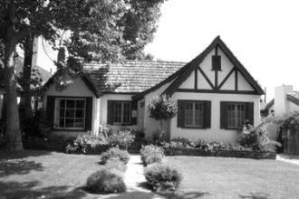 |
| InsideCity | 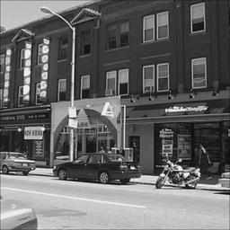 |  | 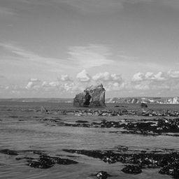 |  |
| TallBuilding |  | 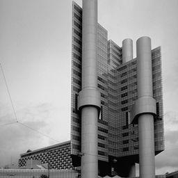 | 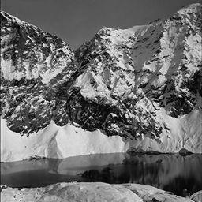 |  |
| Street |  |  |  |  |
| Highway |  |  | 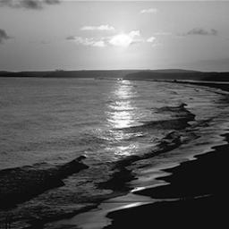 |  |
| OpenCountry |  | 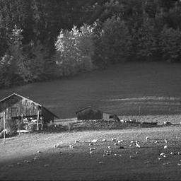 |  |  |
| Coast | 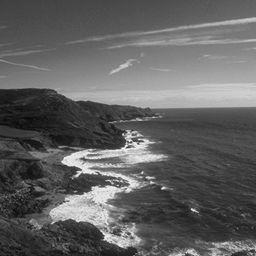 |  |  |  |
| Mountain |  |  | 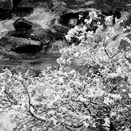 |  |
| Forest |  |  |  |  |

