# 廖景輝 <span style="color:red">(1071082S)</span>

# Project 3 / Scene recognition with bag of words

## Overview
The project is related to 
> * Examine the task of scene recognition with tiny images and nearest neighbor classification 
  * Bags of quantized local features and linear classifiers learned by support vector machines
  
## Implementation
In this homework, in order to do image recognition, we will need to implement `Image representation` first, and then we can use it to get features from test data and train data. With the information above, we further implement `Classifier` to classify different scenes. After these two part are finished, we can recognize the category of images. 
### 1. Image representations
In this part, we will implement two different image representation methods. The easy one is `tiny image`, and the other is more accurate one - `bags of SIFT`.

#### tiny images
I resize input images to 16 * 16 numpy array, reshape it to size 1 * 256 numpy array, and normalize it. After the procedure above, we can get the features of input images. Obviously, just resizing the image to smaller one as our features is a rough method. Because we don't get its representative features. So the accuracy wouldn't be too high as we predict.
```
def get_tiny_images(image_paths):

    resize_len = 16;
    for idx, img_path in enumerate(image_paths):
        img = Image.open(img_path);
        img_resize = img.resize((resize_len,resize_len),Image.BILINEAR);
        img_resize = np.array(img_resize);
        img_resize = np.reshape(img_resize,(1,resize_len*resize_len));
        img_avg = np.average(img_resize);
        img_var = np.var(img_resize);
        img_nor = (img_resize - img_avg) / math.sqrt(img_var);
        if idx == 0:
            tiny_images = img_nor;
        else:
            tiny_images = np.concatenate((tiny_images,img_nor));

    return tiny_images
```

#### Bag of SIFTs
* build vocabulary

    In order to get bags of quantized SIFT features, we will build vocabulary first. By sampling many local features from training sets and clustering them with k-means. We can build vocabulary accurately. In this code, we can change the `vocab_size` in "proj3.py" to change the total numbers of clusters and change the execution time and accuracy of building vocabulary. After finishing this part, we will save the vocabulary in `vocab.pkl`. 
    
    ```
    def build_vocabulary(image_paths, vocab_size):
        bag_of_features = []
        print("Extract SIFT features")
        for path in image_paths:
            img = np.asarray(Image.open(path),dtype='float32')
            frames, descriptors = dsift(img, step=[5,5], fast=True)
            bag_of_features.append(descriptors)
        bag_of_features = np.concatenate(bag_of_features, axis=0).astype('float32')
        print("Compute vocab")
        start_time = time()
        vocab = kmeans(bag_of_features, vocab_size, initialization="PLUSPLUS")        
        end_time = time()
        print("It takes ", (end_time - start_time), " to compute vocab.")

        return vocab
    ```
* get bags of feature

    At first, I get vocabulary information by loading `vocab.pkl`. And then we extract the features from input images and classify them into each cluster by calculate the difference between each input feature and cluster's feature. At the same time, we build a histogram indicating how many times each cluster was used and then normalized it. At this point, we can get the image_feats for one image. And after the loop operation, we can get the whole features of input image set.

    ```
    def get_bags_of_sifts(image_paths):
        # load vocab.pkl
        with open('vocab.pkl','rb') as f:
            vocab = pickle.load(f)
        centroid_num = vocab.shape[0];
        
        # initial output
        image_feats = np.zeros([len(image_paths),centroid_num])
        
        for idx,path in enumerate(image_paths):
            img = np.asarray(Image.open(path),dtype='float32');
            frames, descriptors = dsift(img, step=[5,5], fast=True);
            dist = distance.cdist(vocab, descriptors, 'euclidean');
            category_result = np.argmin(dist,axis=0);
            hist_value, bins = np.histogram(category_result,bins = range(centroid_num+1));    
            normalize = np.linalg.norm(hist_value,ord=1,axis=0);
            if normalize == 0:
                image_feats[idx,:] = hist_value;
            else:
                image_feats[idx,:] = hist_value / normalize;
                
        return image_feats
    ```

### 2. Classifier
In this part, we will implement classifier in order to use the train_image_feats, training label, and test_image_feats to classify test images into several categories. And I implement these two methods below.

* nearest_neighbor

    nearest_neighbor simply find the smallest distances between train_image_feats and test_image_feats for each feature. And when we find the smallest distance, we find its correspondent training label. Finally, the recognized category of scene is based on this training label. 
    ```
    def nearest_neighbor_classify(train_image_feats, train_labels, test_image_feats):
        # initialization
        test_predicts = [0 for i in range(test_image_feats.shape[0])];
        
        # calculate the distance
        dist = distance.cdist(test_image_feats,train_image_feats,'euclidean');
        
        # find the nearest-neighbor
        dist_argmin = np.argmin(dist,axis=1);
        for test_num in range(test_image_feats.shape[0]):
            test_predicts[test_num] = train_labels[dist_argmin[test_num]];

        return test_predicts
    ```

* linear support_vector_machine

    In the code below, I use the `LinearSVC` function and tune the cost term `"C"` to get the highest accuracy.
    ```
    def svm_classify(train_image_feats, train_labels, test_image_feats):
        classifier = LinearSVC(C= 0.0001)
        classifier.fit(train_image_feats, train_labels)
        pred_label = classifier.predict(test_image_feats)
        
        return pred_label
    ```

### 3. [Extra credit] Experiment with many different vocabulary sizes and report performance
<table>
	<tr> 
		<td>vocab_size</td>
		<td> 200</td>
        <td> 400</td>
        <td> 800</td>
    </tr>
	<tr>
		<td> NN</td>
		<td> 0.511</td>
		<td> 0.519</td>
        <td> 0.486</td>
	</tr>
	<tr>
		<td> SVM(C=100)</td>
		<td> 0.686</td>
        <td> 0.701</td>
        <td> 0.718</td>
	</tr>
</table>

From the result above, except the condition of vocab=800/NN, the accuracy grows with the vocab_size becomes larger. And it is the same as our expected.

## Results
### Accuracy 
<table>
	<tr> 
		<td></td>
		<td> NN</td>
        <td> SVM(C=100)</td>
    </tr>
	<tr>
		<td> tiny image</td>
		<td> 0.224</td>
		<td> 0.208</td>
	</tr>
	<tr>
		<td> bag of SIFT(vocab=400)</td>
		<td> 0.519</td>
        <td> 0.701</td>
	</tr>
</table>

From the result above, we can find that the accuracy of bag-of-SIFT is better than tiny image. And with appropriate parameter of SVM method, we can get a more accurate result than near-neighbor method.

### LinearSVC with different cost "C"
#### method
<table>
	<tr> 
		<td></td>
		<td> accuracy</td>
    </tr>
	<tr>
		<td> C = 0.001</td>
		<td> 0.411</td>
	</tr>
    <tr>
		<td> C = 0.01</td>
		<td> 0.418</td>
	</tr>
    <tr>
		<td> C = 0.1</td>
		<td> 0.436</td>
	</tr>
    <tr>
		<td> C = 1</td>
		<td> 0.534</td>
	</tr>
    <tr>
		<td> C = 10</td>
		<td> 0.644</td>
	</tr>
    <tr>
		<td> C = 100</td>
		<td> 0.701</td>
	</tr>
    <tr>
		<td> C = 1000</td>
		<td> 0.636</td>
	</tr>

</table>

In this part, I fine-tune the parameter "C" to get a better accuracy. Finally, I choose "C=100". Because for  large values of C, the optimization will choose a smaller-margin hyperplane if that hyperplane does a better job of getting all the training points classified correctly. 

### Confusion matrix (with vocab_size = 400)
* tiny_image + nearest_neighbor (accuracy = 0.224)

    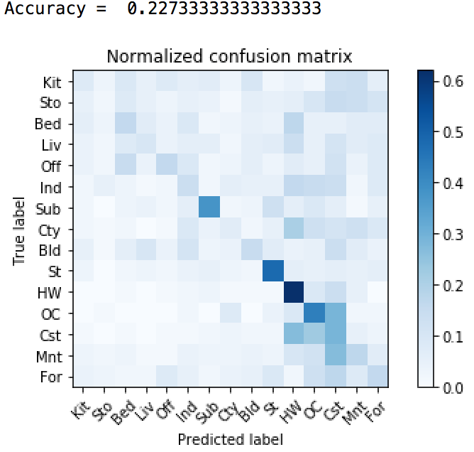
* tiny_image + support_vector_machine (accuracy = 0.208)

    
* bag_of_sift + nearest_neighbor (accuracy = 0.519)

    
* bag_of_sift + support_vector_machine (accuracy = 0.701)

    


### Visualization
#### method: bags-of-SIFT (vocab_size=400) + linearSVC(C=100)
| Category name | Sample training images | Sample true positives | False positives with true label | False negatives with wrong predicted label |
| :-----------: | :--------------------: | :-------------------: | :-----------------------------: | :----------------------------------------: |
| Kitchen |  |  |  |  |
| Store |  |  |  |  |
| Bedroom |  | 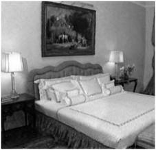 |  |  |
| LivingRoom |  | 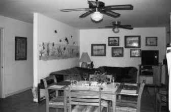 | 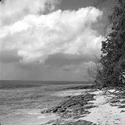 |  |
| Office |  |  |  | 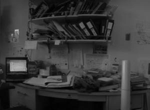 |
| Industrial | 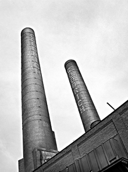 |  |  |  |
| Suburb |  |  |  | 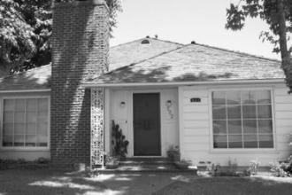 |
| InsideCity |  |  |  | 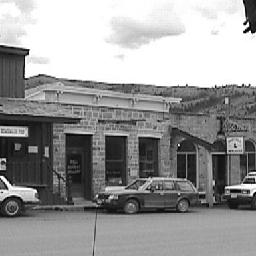 |
| TallBuilding | 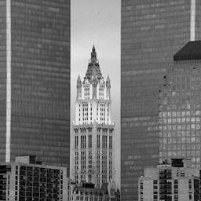 |  |  |  |
| Street |  |  |  |  |
| Highway |  | 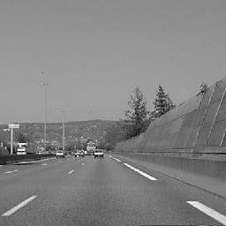 |  |  |
| OpenCountry |  |  |  | 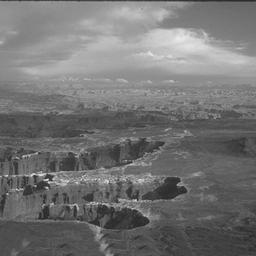 |
| Coast |  |  |  |  |
| Mountain |  |  | 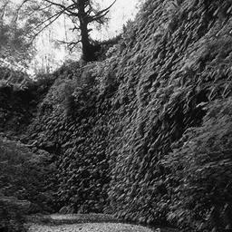 |  |
| Forest |  |  |  |  |

